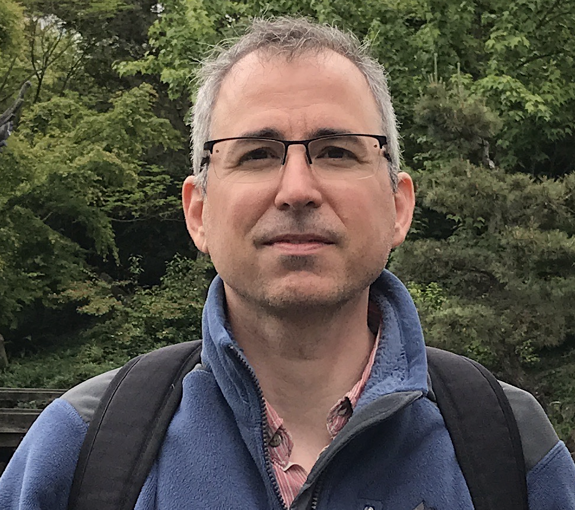

<!---
Correctness 2017: First International Workshop on Software Correctness for HPC Applications
------

#### November 12, 2017
#### Colorado Convention Center, Room 501
#### Denver, Colorado, USA
##### Held in conjunction with SC17: [The International Conference for High Performance Computing, Networking, Storage and Analysis](http://sc17.supercomputing.org/)
##### In cooperation with 
-->

<h2>Correctness 2017: First International Workshop on Software Correctness for HPC Applications</h2>

<h4> November 12, 2017 (9am - 12:30pm) </h4>

<h4> Colorado Convention Center, Room 501 </h4>

<h4> Denver, Colorado, USA </h4>

<h5> Held in conjunction with SC17: <a href="http://sc17.supercomputing.org/">The International Conference for High Performance Computing, Networking, Storage and Analysis</a> </h5>

In cooperation with  

----

Ensuring correctness in high-performance computing (HPC) applications is one of the fundamental challenges that the HPC community faces today. While significant advances in verification, testing, and debugging have been made to isolate software errors (or defects) in the context of non-HPC software, several factors make achieving correctness in HPC applications and systems much more challenging than in general systems software—growing heterogeneity (architectures with CPUs, GPUs, and special purpose accelerators), massive scale computations (very high degree of concurrency), use of combined parallel programing models (e.g., MPI+X), new scalable numerical algorithms (e.g., to leverage reduced precision in floating-point arithmetic), and aggressive compiler optimizations/transformations are some of the challenges that make correctness harder in HPC. The following report lays out the key challenges and research areas of HPC correctness: [DOE Report of the HPC Correctness Summit](https://science.energy.gov/~/media/ascr/pdf/programdocuments/docs/2017/HPC_Correctness_Report.pdf).

As the complexity of future architectures, algorithms, and applications in HPC increases, the ability to fully exploit exascale systems will be limited without correctness. With the continuous use of HPC software to advance scientific and technological capabilities, novel techniques and practical tools for software correctness in HPC are invaluable.

The goal of the Correctness Workshop is to bring together researchers and developers to present and discuss novel ideas to address the problem of correctness in HPC. The workshop will feature contributed papers and invited talks in this area.

----
### <a class="anchor" name="topics">Workshop Topics</a>

Topics of interest include, but are not limited to:

*	Formal methods and rigorous mathematical techniques for correctness in HPC applications/systems
*	Frameworks to address the challenges of testing complex HPC applications (e.g., multiphysics applications)
*	Approaches for the specification of numerical algorithms with the goal of correctness checking
*	Error identification in the design and implementation of numerical algorithms using finite-precision floating point numbers
*	Static and dynamic analysis to test and check correctness in the entire HPC software ecosystem
*	Practical and scalable tools for model checking, verification, certification, or symbolic execution
*	Analysis of error propagation and error handling in HPC libraries
*	Techniques to control the effect of non-determinism when debugging and testing HPC software
*	Scalable debugging solutions for large-scale HPC applications
*	Predictive debugging and testing approaches to forecast the occurrence of errors in specific conditions
*	Machine learning and anomaly detection approaches for bug detection and localization
*	Metrics to measure the degree of correctness of HPC applications/systems
*	Community-wide models to share past successes (e.g., bug report databases, reproducible test cases)

----
### <a class="anchor" name="submissions"> Submissions and Format </a>

Authors are invited to submit manuscripts in English structured as technical or experience papers not exceeding **6 pages** of content. The 6-page limit includes figures, tables and appendices, but does not include references, for which there is no page limit. Submissions must use the [ACM format](http://www.acm.org/sigs/publications/proceedings-templates) (please use the sigconf format with default options).

<!---
Submissions are expected in the following two categories; all submissions must use the [ACM format](http://www.acm.org/sigs/publications/proceedings-templates).

* **Regular papers:** maximum of 6 pages. The 6-page limit includes figures, tables and appendices, but does not include references, for which there is no page limit.
* **Short papers:** position, opinion, or short experience papers; 4 pages maximum, including everything.
-->

Submitted papers must represent original unpublished research that is not currently under review for any other venue. Papers not following these guidelines will be rejected without review. Submissions received after the due date, exceeding length limit, or not appropriately structured may also not be considered. At least one author of an accepted paper must register for and attend the workshop. Authors may contact the workshop organizers for more information. Papers should be submitted electronically in EasyChair at: [https://easychair.org/conferences/?conf=correctness2017](https://easychair.org/conferences/?conf=correctness2017).

---
###  <a class="anchor" name="proceedings"> Proceedings </a>

The proceedings will be archived in both the ACM Digital Library and IEEE Xplore through [SIGHPC](http://www.sighpc.org).

---
### <a class="anchor" name="dates"> Important Dates </a>

<!---
* Paper submissions open: June 2, 2017
-->
* Paper submissions due: ~~August 18, 2017~~ ~~**Extended:** August 25, 2017~~ Last extendend deadline: August 28, 2017, 12pm PST
* Notification of acceptance: ~~September 15, 2017~~ September 18, 2017
* Camera-ready papers due (firm): October 6, 2017
* Workshop: SC 2017, Colorado Convention Center (Room 501), Sun, Nov 12 (at 9am-12:30pm), 2017

---
### <a class="anchor" name="org">Organizers</a>

[Ignacio Laguna](https://sites.google.com/site/researchlaguna/), LLNL  
[Cindy Rubio-González](http://web.cs.ucdavis.edu/~rubio/), UC Davis

---
### <a class="anchor" name="pc">Program Committee</a>

[David Abramson](https://rcc.uq.edu.au/profile/104/david-abramson), The University of Queensland, Australia  
[Eva Darulova](https://people.mpi-sws.org/~eva/), MPI-SWS, Germany   
[Alastair Donaldson](http://www.imperial.ac.uk/people/alastair.donaldson), Imperial College London, UK  
[Ganesh Gopalakrishnan](https://www.cs.utah.edu/~ganesh/), University of Utah, USA  
[Paul Hovland](https://www.mcs.anl.gov/person/paul-hovland), ANL, USA  
[Costin Iancu](https://crd.lbl.gov/departments/computer-science/CLaSS/staff/costin-iancu/), LBNL, USA  
[Sriram Krishnamoorthy](http://hpc.pnl.gov/people/sriram/), PNNL, USA  
[David Lecomber](), Allinea/ARM, UK  
[Richard	Lethin](http://seas.yale.edu/faculty-research/faculty-directory/richard-a-lethin), Reservoir Labs, Yale University, USA  
[Matthias Müller](http://www.rwth-aachen.de/cms/root/Die-RWTH/Kontakt-Anreise/Kontakt-RWTH-Aachen/~bdfr/Mitarbeiter-CAMPUS-/?gguid=0xB8B55109186DA749BE27700404DA28D8&lidx=1&allou=1), RWTH Aachen University, Germany  
[Feng Qin](http://web.cse.ohio-state.edu/~qin.34/), The Ohio State University, USA  
[Nathalie Revol](http://perso.ens-lyon.fr/nathalie.revol/), INRIA - ENS de Lyon, France   
[Kento Sato](https://people.llnl.gov/sato5), Lawrence Livermore National Laboratory, USA  
[Koushik Sen](https://people.eecs.berkeley.edu/~ksen/), UC Berkeley, USA  
[Stephen Siegel](https://vsl.cis.udel.edu/siegel.html), University of Delaware, USA  
[Armando Solar-Lezama](https://people.csail.mit.edu/asolar/), MIT, USA

---
### <a class="anchor" name="venue">Venue</a>

Colorado Convention Center  
700 14th St, Denver, CO 80202  
Room 501

---
### <a class="anchor" name="program">Program</a>
 

#### Keynote Address

##### [Stephen Siegel](http://vsl.cis.udel.edu/siegel.html) (University of Delaware)

<table cellspacing="25">
<tr> <td valign="top">  </td>
<td width="3%">  </td>
<td> Stephen Siegel is an Associate Professor in the Department of Computer and Information Sciences and the Department of Mathematical Sciences at the University of Delaware. He received the Ph.D. in mathematics from the University of Chicago in 1993.  As a working mathematician, first at Northwestern University and then at the University of Massachusetts Amherst, he worked in the areas of finite group theory, and the representation theory and cohomology of finite groups.  Much of his work focused on computational issues in those fields.  At UMass, his interests veered towards software engineering, and he worked as a software engineer and then research scientist in the Laboratory for Advanced Software Engineering Research, focusing in particular on formal verification of concurrent systems.  He joined the University of Delaware in 2006 and started the Verified Software Laboratory (VSL), which researches new techniques for verifying and debugging parallel programs, especially programs used for computational science. The VSL has produced the symbolic execution and model checking platform CIVL, among other tools. </td> </tr>
</table>  

<!---
We are glad to announce that [Stephen F. Siegel](http://vsl.cis.udel.edu/siegel.html), Associate Professor in the Department of Computer and Information Sciences at the University of Delaware, will deliver the keynote address at Correctness 2017!
-->

#### Schedule
<!---
 Preliminary only 
-->

###### Opening
<table>
<tr><td width="15">  </td> <td>09:00 - 09:10:  Opening remarks	</td> </tr>
<tr><td width="15">  </td> <td>09:10 - 10:00:  Keynote Address: <b>A Verification Language for High Performance Computing</b>, Stephen Siegel </td> </tr>
</table>

###### Break
<table>
<tr><td width="15">  </td> <td>10:00 - 10:30:  Break (coffee provided by SC17) </td> </tr>
</table>

###### Applications & Algorithms Correctness
<table>
<tr><td width="15">  </td> <td>10:30 - 10:47:  <b>"Verifying Concurrency in an Adaptive Ocean Circulation Model"</b>, Alper Altuntas and John Baugh (<a href="papers/altunas.pdf">slides</a>) </td> </tr>
<tr><td width="15">  </td> <td>10:47 - 11:04:  <b>"Quality Assurance and Error Identification for the Community Earth System Model"</b>, Allison Baker, Daniel Milroy, Dorit Hammerling and Haiying Xu (<a href="papers/abaker.pdf">slides</a>) </td> </tr>
<tr><td width="15">  </td> <td>11:04 - 11:21:  <b>"A Family of Provably Correct Algorithms for Exact Triangle Counting"</b>, Matthew Lee and Tze Meng Low (<a href="papers/low.pdf">slides</a>) </td> </tr>
</table>

###### Runtime Systems Correctness
<table>
<tr><td width="15">  </td> <td>11:21 - 11:38:  <b>"Verifying MPI applications with SimGridMC"</b>, The Anh Pham, Thierry Jéron and Martin Quinson (<a href="papers/quinson.pdf">slides</a>) </td> </tr>
<tr><td width="15">  </td> <td>11:38 - 11:55:  <b>"Runtime Correctness Checking for Emerging Programming Paradigms"</b>, Joachim Protze, Christian Terboven, Matthias S. Müeller, Serge Petiton, Nahid Emad, Hitoshi Murai and Taisuke Boku (<a href="papers/protze.pdf">slides</a>) </td> </tr>
</table>

###### Code Generation & Code Equivalence Correctness
<table>
<tr><td width="15">  </td> <td>11:55 - 12:12:  <b>"Verifying the Floating-Point Computation Equivalence of Manually and Automatically Differentiated Code"</b>, Markus Schordan, Jan Hückelheim, Pei-Hung Lin and Harshitha Gopalakrishnan (<a href="papers/schordan.pdf">slides</a>) </td> </tr>
<tr><td width="15">  </td> <td>12:12 - 12:29:  <b>"Towards Self-Verification in Finite Difference Code Generation"</b>, Jan Hückelheim, Ziqing Luo, Fabio Luporini, Navjot Kukreja, Michael Lange, Gerard Gorman, Stephen Siegel, Matthew Dwyer and Paul Hovland (<a href="papers/huckelheim.pdf">slides</a>) </td> </tr>
</table>

---
###  <a class="anchor" name="contact">Contact Information</a>

Please address workshop questions to Ignacio Laguna (ilaguna@llnl.gov) and/or Cindy Rubio-González (crubio@ucdavis.edu).

