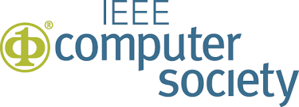

<!---
Correctness 2018: Second International Workshop on Software Correctness for HPC Applications
------

#### November 12, 2018
#### Kay Bailey Hutchison Convention Center, Room 501
#### Dallas, Texas, USA
##### Held in conjunction with SC18: [The International Conference for High Performance Computing, Networking, Storage and Analysis](https://sc18.supercomputing.org/)
##### In cooperation with 
-->

<h2>Correctness 2018: Second International Workshop on Software Correctness for HPC Applications</h2>

<h4> November 12, 2018 (full day) </h4>

<h4> Kay Bailey Hutchison Convention Center, Room TBD </h4>

<h4> Dallas, Texas, USA </h4>

<h5> Held in conjunction with SC18: <a href="https://sc18.supercomputing.org/">The International Conference for High Performance Computing, Networking, Storage and Analysis</a> </h5>

In cooperation with  

----

Ensuring correctness in high-performance computing (HPC) applications is one of the fundamental challenges that the HPC community faces today. While significant advances in verification, testing, and debugging have been made to isolate software errors (or defects) in the context of non-HPC software, several factors make achieving correctness in HPC applications and systems much more challenging than in general systems software—growing heterogeneity (architectures with CPUs, GPUs, and special purpose accelerators), massive scale computations (very high degree of concurrency), use of combined parallel programing models (e.g., MPI+X), new scalable numerical algorithms (e.g., to leverage reduced precision in floating-point arithmetic), and aggressive compiler optimizations/transformations are some of the challenges that make correctness harder in HPC. The following report lays out the key challenges and research areas of HPC correctness: [DOE Report of the HPC Correctness Summit](https://science.energy.gov/~/media/ascr/pdf/programdocuments/docs/2017/HPC_Correctness_Report.pdf).

As the complexity of future architectures, algorithms, and applications in HPC increases, the ability to fully exploit exascale systems will be limited without correctness. With the continuous use of HPC software to advance scientific and technological capabilities, novel techniques and practical tools for software correctness in HPC are invaluable.

The goal of the Correctness Workshop is to bring together researchers and developers to present and discuss novel ideas to address the problem of correctness in HPC. The workshop will feature contributed papers and invited talks in this area.

----
### <a class="anchor" name="topics">Workshop Topics</a>

Topics of interest include, but are not limited to:

#### Correctness in Scientific Applications and Algorithms
* Formal methods and rigorous mathematical techniques for correctness in HPC applications
* Frameworks to address the challenges of testing complex HPC applications (e.g., multiphysics applications)
* Approaches for the specification of numerical algorithms with the goal of correctness checking
* Error identification in the design and implementation of numerical algorithms using finite-precision floating point numbers

#### Tools for Debugging, Testing, and Correctness Checking
* Tools to control the effect of non-determinism when debugging and testing HPC software
* Scalable debugging solutions for large-scale HPC applications
* Scalable tools for model checking, verification, certification, or symbolic execution
* Static and dynamic analysis to test and check correctness in the entire HPC software ecosystem
* Predictive debugging and testing approaches to forecast the occurrence of errors in specific conditions
* Machine learning and anomaly detection for bug detection and localization

#### Programing Models and Runtime Systems Correctness
* Correctness in emerging HPC programing models
* Analysis of software error propagation and error handling in HPC runtime systems and libraries
* Metrics to measure the degree of correctness of HPC software
* Specifications to check the correctness of runtime systems

#### Other Areas
* Large databases of bug reports and/or reproducible test cases of HPC software
* Benchmarks to test the effectiveness of HPC correctness tools

----
### <a class="anchor" name="submissions"> Submissions and Format </a>

Authors are invited to submit manuscripts in English structured as technical or experience papers not exceeding **8 pages** of content, including everything. Submissions must use the [IEEE format](https://www.ieee.org/conferences/publishing/templates.html).

<!---
Submissions are expected in the following two categories; all submissions must use the [ACM format](http://www.acm.org/sigs/publications/proceedings-templates).

* **Regular papers:** maximum of 6 pages. The 6-page limit includes figures, tables and appendices, but does not include references, for which there is no page limit.
* **Short papers:** position, opinion, or short experience papers; 4 pages maximum, including everything.
-->

Submitted papers must represent original unpublished research that is not currently under review for any other venue. Papers not following these guidelines will be rejected without review. Submissions received after the due date, exceeding length limit, or not appropriately structured may also not be considered. At least one author of an accepted paper must register for and attend the workshop. Authors may contact the workshop organizers for more information. Papers should be submitted electronically at: [(site coming soon)](https://submissions.supercomputing.org/).

---
###  <a class="anchor" name="proceedings"> Proceedings </a>

The proceedings will be archived in IEEE Xplore via [TCHPC](https://tc.computer.org/tchpc/).

---
### <a class="anchor" name="dates"> Important Dates </a>

* Paper submissions due: August 10, 2018
* Notification of acceptance: September 21, 2018
* E-copyright registration completed by authors (firm): October 3, 2018
* Camera-ready papers due (firm): October 8, 2018

---
### <a class="anchor" name="org">Organizers</a>

[Ignacio Laguna](https://sites.google.com/site/researchlaguna/), LLNL  
[Cindy Rubio-González](http://web.cs.ucdavis.edu/~rubio/), UC Davis

---
### <a class="anchor" name="pc">Program Committee</a>

[Eva Darulova](https://people.mpi-sws.org/~eva/), MPI-SWS, Germany   
[Ganesh Gopalakrishnan](https://www.cs.utah.edu/~ganesh/), University of Utah, USA  
[Paul Hovland](http://www.mcs.anl.gov/person/paul-hovland), Argonne National Laboratory, USA  
[Geoff Hulette]( http://www.sandia.gov/), Sandia National Laboratories, USA   
[Costin Iancu](https://crd.lbl.gov/departments/computer-science/CLaSS/staff/costin-iancu/), Lawrence Berkeley National Laboratory, USA  
[Sriram Krishnamoorthy](http://hpc.pnl.gov/people/sriram/), Pacific Northwest National Laboratory, USA  
[Richard	Lethin](http://seas.yale.edu/faculty-research/faculty-directory/richard-a-lethin), Reservoir Labs, Yale University, USA  
[Francesco Logozzo](https://research.fb.com/people/logozzo-francesco/), Facebook Research, USA  
[Jackson Mayo]( http://www.sandia.gov/), Sandia National Laboratories, USA  
[John Mellor-Crummey](https://www.cs.rice.edu/~johnmc/), Rice University, USA  
[Matthias Müller](http://www.rwth-aachen.de/cms/root/Die-RWTH/Kontakt-Anreise/Kontakt-RWTH-Aachen/~bdfr/Mitarbeiter-CAMPUS-/?gguid=0xB8B55109186DA749BE27700404DA28D8&lidx=1&allou=1), RWTH Aachen University, Germany  
[Tristan	 Ravitch]( https://galois.com/team/tristan-ravitch/), Galois, Inc, USA  
[Nathalie Revol](http://perso.ens-lyon.fr/nathalie.revol/), INRIA - ENS de Lyon, France  
[Markus Schordan]( https://people.llnl.gov/schordan1), Lawrence Livermore National Laboratory, USA  
[Koushik Sen](https://people.eecs.berkeley.edu/~ksen/), UC Berkeley, USA  
[Stephen Siegel](https://vsl.cis.udel.edu/siegel.html), University of Delaware, USA  

---
### <a class="anchor" name="venue">Venue</a>

Kay Bailey Hutchison Convention Center  
650 S Griffin St, Dallas, TX 75202  
Room: TBD

---
### <a class="anchor" name="program">Program</a>
 

TBD

---
###  <a class="anchor" name="contact">Contact Information</a>

Please address workshop questions to Ignacio Laguna (ilaguna@llnl.gov) and/or Cindy Rubio-González (crubio@ucdavis.edu).

