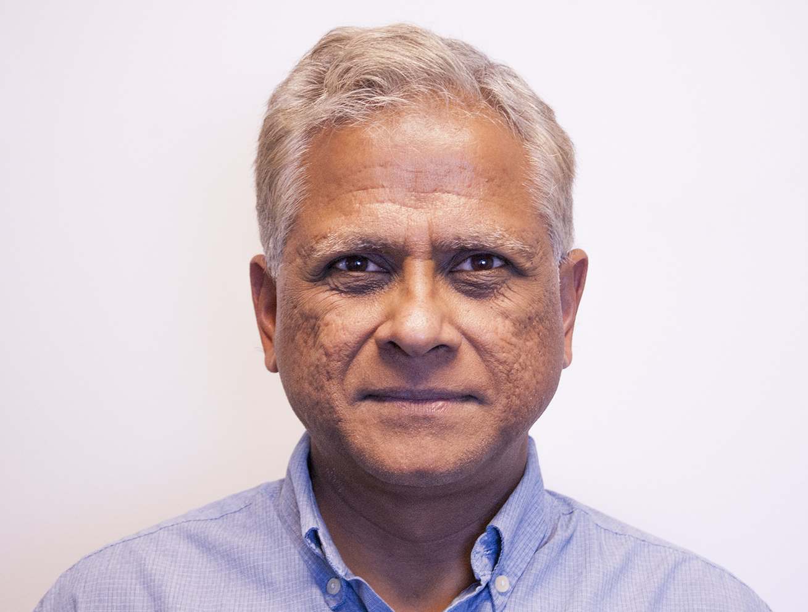
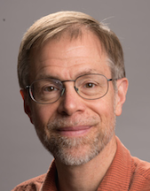

<!---
Correctness 2018: Second International Workshop on Software Correctness for HPC Applications
------

#### November 12, 2018
#### Kay Bailey Hutchison Convention Center, Room 501
#### Dallas, Texas, USA
##### Held in conjunction with SC18: [The International Conference for High Performance Computing, Networking, Storage and Analysis](https://sc18.supercomputing.org/)
##### In cooperation with 
-->

<h2>Correctness 2018: Second International Workshop on Software Correctness for HPC Applications</h2>

<h4> November 12, 2018 (full day) </h4>

<h4> Kay Bailey Hutchison Convention Center, Room: D171 (Level 1) </h4>

<h4> Dallas, Texas, USA </h4>

<h5> Held in conjunction with SC18: <a href="https://sc18.supercomputing.org/">The International Conference for High Performance Computing, Networking, Storage and Analysis</a> </h5>

In cooperation with  

----

Ensuring correctness in high-performance computing (HPC) applications is one of the fundamental challenges that the HPC community faces today. While significant advances in verification, testing, and debugging have been made to isolate software errors (or defects) in the context of non-HPC software, several factors make achieving correctness in HPC applications and systems much more challenging than in general systems software—growing heterogeneity (architectures with CPUs, GPUs, and special purpose accelerators), massive scale computations (very high degree of concurrency), use of combined parallel programing models (e.g., MPI+X), new scalable numerical algorithms (e.g., to leverage reduced precision in floating-point arithmetic), and aggressive compiler optimizations/transformations are some of the challenges that make correctness harder in HPC. The following report lays out the key challenges and research areas of HPC correctness: [DOE Report of the HPC Correctness Summit](https://science.energy.gov/~/media/ascr/pdf/programdocuments/docs/2017/HPC_Correctness_Report.pdf).

As the complexity of future architectures, algorithms, and applications in HPC increases, the ability to fully exploit exascale systems will be limited without correctness. With the continuous use of HPC software to advance scientific and technological capabilities, novel techniques and practical tools for software correctness in HPC are invaluable.

The goal of the Correctness Workshop is to bring together researchers and developers to present and discuss novel ideas to address the problem of correctness in HPC. The workshop will feature contributed papers and invited talks in this area.

----
### <a class="anchor" name="topics">Workshop Topics</a>

Topics of interest include, but are not limited to:

#### Correctness in Scientific Applications and Algorithms
* Formal methods and rigorous mathematical techniques for correctness in HPC applications
* Frameworks to address the challenges of testing complex HPC applications (e.g., multiphysics applications)
* Approaches for the specification of numerical algorithms with the goal of correctness checking
* Error identification in the design and implementation of numerical algorithms using finite-precision floating point numbers

#### Tools for Debugging, Testing, and Correctness Checking
* Tools to control the effect of non-determinism when debugging and testing HPC software
* Scalable debugging solutions for large-scale HPC applications
* Scalable tools for model checking, verification, certification, or symbolic execution
* Static and dynamic analysis to test and check correctness in the entire HPC software ecosystem
* Predictive debugging and testing approaches to forecast the occurrence of errors in specific conditions
* Machine learning and anomaly detection for bug detection and localization

#### Programing Models and Runtime Systems Correctness
* Correctness in emerging HPC programing models
* Analysis of software error propagation and error handling in HPC runtime systems and libraries
* Metrics to measure the degree of correctness of HPC software
* Specifications to check the correctness of runtime systems

#### Other Areas
* Large databases of bug reports and/or reproducible test cases of HPC software
* Benchmarks to test the effectiveness of HPC correctness tools

----
### <a class="anchor" name="submissions"> Submissions and Format </a>

Authors are invited to submit manuscripts in English structured as technical or experience papers not exceeding **8 pages** of content, including everything. Submissions must use the [IEEE format](https://www.ieee.org/conferences/publishing/templates.html).

<!---
Submissions are expected in the following two categories; all submissions must use the [ACM format](http://www.acm.org/sigs/publications/proceedings-templates).

* **Regular papers:** maximum of 6 pages. The 6-page limit includes figures, tables and appendices, but does not include references, for which there is no page limit.
* **Short papers:** position, opinion, or short experience papers; 4 pages maximum, including everything.
-->

Submitted papers must represent original unpublished research that is not currently under review for any other venue. Papers not following these guidelines will be rejected without review. Submissions received after the due date, exceeding length limit, or not appropriately structured may also not be considered. At least one author of an accepted paper must register for and attend the workshop. Authors may contact the workshop organizers for more information. Papers should be submitted electronically at: [https://submissions.supercomputing.org/?page=Submit&id=SC18WorkshopCorrectness2018Submission&site=sc18](https://submissions.supercomputing.org/?page=Submit&id=SC18WorkshopCorrectness2018Submission&site=sc18).

#### SC Reproducibility Initiative

We encourage authors to submit an **optional** artifact description (AD) appendix along with their paper, describing the details of their software environments and computational experiments to the extent that an independent person could replicate their results. The AD appendix is not included in the 8-page limit of the paper and should not exceed **2 pages** of content. For more details of the **SC Reproducibility Initiative** please see: [https://sc18.supercomputing.org/submit/sc-reproducibility-initiative/](https://sc18.supercomputing.org/submit/sc-reproducibility-initiative/).

---
###  <a class="anchor" name="proceedings"> Proceedings </a>

The proceedings will be archived in IEEE Xplore via [TCHPC](https://tc.computer.org/tchpc/).

---
### <a class="anchor" name="dates"> Important Dates </a>
Due to several requests, we have extended the submission deadline to Aug/20.

* Paper submissions due: ~~August 10, 2018~~ ~~**Extended:** August 17, 2018~~ Last extendend deadline: August 20, 2018
* Notification of acceptance: September 21, 2018
* E-copyright registration completed by authors (firm): ~~October 3, 2018~~ ~~October 15, 2018~~ October 19, 2018
* Camera-ready papers due (firm): ~~October 8, 2018~~ ~~October 15, 2018~~ October 19, 2018

All time zones are AOE.

---
### <a class="anchor" name="org">Organizers</a>

[Ignacio Laguna](https://sites.google.com/site/researchlaguna/), LLNL  
[Cindy Rubio-González](http://web.cs.ucdavis.edu/~rubio/), UC Davis

---
### <a class="anchor" name="pc">Program Committee</a>

[Eva Darulova](https://people.mpi-sws.org/~eva/), MPI-SWS, Germany   
[Ganesh Gopalakrishnan](https://www.cs.utah.edu/~ganesh/), University of Utah, USA  
[Paul Hovland](http://www.mcs.anl.gov/person/paul-hovland), Argonne National Laboratory, USA  
[Geoff Hulette]( http://www.sandia.gov/), Sandia National Laboratories, USA   
[Costin Iancu](https://crd.lbl.gov/departments/computer-science/CLaSS/staff/costin-iancu/), Lawrence Berkeley National Laboratory, USA  
[Sriram Krishnamoorthy](http://hpc.pnl.gov/people/sriram/), Pacific Northwest National Laboratory, USA  
[Richard	Lethin](http://seas.yale.edu/faculty-research/faculty-directory/richard-a-lethin), Reservoir Labs, Yale University, USA  
[Francesco Logozzo](https://research.fb.com/people/logozzo-francesco/), Facebook Research, USA  
[Jackson Mayo]( http://www.sandia.gov/), Sandia National Laboratories, USA  
[John Mellor-Crummey](https://www.cs.rice.edu/~johnmc/), Rice University, USA  
[Matthias Müller](http://www.rwth-aachen.de/cms/root/Die-RWTH/Kontakt-Anreise/Kontakt-RWTH-Aachen/~bdfr/Mitarbeiter-CAMPUS-/?gguid=0xB8B55109186DA749BE27700404DA28D8&lidx=1&allou=1), RWTH Aachen University, Germany  
[Tristan	 Ravitch]( https://galois.com/team/tristan-ravitch/), Galois, Inc, USA  
[Nathalie Revol](http://perso.ens-lyon.fr/nathalie.revol/), INRIA - ENS de Lyon, France  
[Markus Schordan]( https://people.llnl.gov/schordan1), Lawrence Livermore National Laboratory, USA  
[Koushik Sen](https://people.eecs.berkeley.edu/~ksen/), UC Berkeley, USA  
[Stephen Siegel](https://vsl.cis.udel.edu/siegel.html), University of Delaware, USA  

---
### <a class="anchor" name="venue">Venue</a>

Kay Bailey Hutchison Convention Center  
650 S Griffin St, Dallas, TX 75202  
Room: D171 (Level 1)

---
### <a class="anchor" name="program">Program</a>
 

**Keynote Speaker 1 (Morning Session)**
 

#### [Ganesh L. Gopalakrishnan](https://www.cs.utah.edu/~ganesh/), Professor, School of Computing, University of Utah

**Bio:**
Ganesh L. Gopalakrishnan (Senior Member of IEEE and ACM Distinguished
Scientist) earned his B.Sc.(EE) degree from NIT Calicut in 1978,
M.Tech (EE) from IIT Kanpur in 1980, and PhD in Computer Science from
Stony Brook University in 1986, when he joined the University of Utah.

His external engagements include Visiting Assistant Professorship at
the University of Calgary (1988-89) and sabbatical visits at Stanford
University (1995-96), Intel (2002-03), and sabbatical projects with
Microsoft on developing parallel computing curriculum (2009-10). He
has authored a 2006 Springer book "Computation Engineering: Applied
Automata Theory and Logic," and is finishing a 2018 textbook using
Jupyter notebooks in undergraduate Discrete Math and Automata Theory
classes.

He has published over 180 refereed papers, and has graduated 21 PhD
students. He is serving as the Director of the Center for Parallel
Computing at Utah ("CPU").  He was awarded one of the six "Beacons of
Excellence" Awards for 2012 by the University of Utah for his work on
mentoring undergraduates.

His currently active projects are: Verification Methods and Tool
Frameworks for Parallel and Concurrent Systems, Formal Techniques for
System Resilience, Floating-point Precision Tuning, and Data Race
Checking for OpenMP and GPUs.  His current research grants and
contracts are from NSF (CISE) and DOE (in collaboration with LLNL and
PNNL).

 
#### *Making Formal Methods for HPC Disappear*

**Abstract:** Formal methods include rigorous specification methods that can render
language standards reliable and unambiguous. They also include
rigorous testing methods that target well-specified coverage criteria,
and formal concepts that help guide debugging tool
implementations. Those who say formal methods don't apply to HPC
probably misunderstand formal methods to be some esoteric diversion,
and not as a software productivity booster in the sense we describe.

Undoubtedly, HPC correctness is far too complex: there are the
accidentally flipping bits, unpredictable floating point rounding,
threads that incur a data race, and capricious compilers whose
optimizations change results. All these can severely impact overall
productivity. Formal approaches are possible for many
of these pursuits, while for others they may emerge if one persists,
and if there is a community invested in developing them in the long
run. A worthwhile direction is to invest in formal methods based
pedagogy: not only does this help buy us some time to develop useful
formal methods for HPC, but it also gives some hope to save future
generations from today's debugging drudgery. Today's parallel
computing education still only gives lip service to correctness - let
alone formal.

My talk will try and present examples of all of this. We will present
examples where formal ideas did transition to production-level data
race checking tools. I will also present examples where we finished
production-level tools for floating-point non-reproducibility in the
field, and hope to backfill the formalism eventually.

Eventually, as Rushby says, Formal Methods must "disappear" - be
incorporated into standard practice and we don't see them.

 

**Keynote Speaker 2 (Afternoon Session)**
 

#### [James Demmel](https://people.eecs.berkeley.edu/~demmel/), Dr. Richard Carl Dehmel Distinguished Professor of Computer Science and Mathematics, University of California at Berkeley

**Bio:**
James Demmel is the Dr. Richard Carl Dehmel Distinguished Professor of Computer Science and
Mathematics at the University of California at Berkeley, and Chair of the EECS Dept. His research is in
numerical linear algebra, HPC, and communication avoiding algorithms. He is known for his work on the
LAPACK and ScaLAPACK linear algebra libraries.  He is a member of the NAS, NAE, and American
Academy of Arts and Sciences; a Fellow of the AAAS, ACM, AMS, IEEE and SIAM; and winner of the
IPDPS Charles Babbage Award, IEEE Computer Society Sidney Fernbach Award, the ACM Paris
Kanellakis Award, and numerous best paper prizes.

 
#### *Correctness of Floating Point Programs - Exception Handling and Reproducibility*

**Abstract:** We consider two related aspects of analyzing and guaranteeing correctness
of floating point programs: exception handling and reproducibility.
Exception handling refers to reliable and consistent propagation of errors due
to overflow, invalid operations (like `sqrt(-1)`), convergence failures, etc.
Reproducibility refers to getting bitwise reproducible results from multiple
runs of the same program, e.g., despite parallelism causing floating point
sums to be evaluated in different order with different roundoff errors.
We describe the efforts of two standards committees, the Basic Linear
Algebra Subprograms (BLAS) Standard, and the IEEE 754 Floating Point
Standard, to address these issues, and how these efforts should make it
easier to accomplish these goals for higher level applications, such as
linear algebra libraries.

 

#### Workshop Schedule

###### Keynote 1
<table>
<tr><td width="15">  </td> <td>09:00am - 09:05am:  Opening remarks	</td> </tr>
<tr><td width="15">  </td> <td>09:05am - 10:00am:  Keynote Speaker 1: <b>"Making Formal Methods for HPC Disappear"</b>, Ganesh L. Gopalakrishnan </td> </tr>
</table>

###### Break
<table>
<tr><td width="15">  </td> <td>10:00am - 10:30am:  Break (coffee provided by SC18) </td> </tr>
</table>

###### Applications Correctness
<table>
<tr><td width="15">  </td> <td>10:30am - 10:50am:  <b>"Hybrid Theorem Proving as a Lightweight Method for Verifying Numerical Software"</b>, Alper Altuntas, John Baugh </td> </tr>
<tr><td width="15">  </td> <td>10:50am - 11:10am:  <b>"HPC Software Verification in Action: A Case Study with Tensor Transposition"</b>, Erdal Mutlu, Ajay Panyala, Sriram Krishnamoorthy </td> </tr>
</table>
###### Parallel Tasking
<table>
<tr><td width="15">  </td> <td>11:10am - 11:30am:  <b>"Correctness of Dynamic Dependence Analysis for Implicitly Parallel Tasking Systems"</b>, Wonchan Lee, George Stelle, Patrick McCormick, Alex Aiken </td> </tr>
<tr><td width="15">  </td> <td>11:30am - 11:50am:  <b>"Verifying Qthreads: Is Model Checking Viable for User Level Tasking Runtimes?"</b>, Noah Evans </td> </tr>
</table>
###### OpenMP Data Race Detection
<table>
<tr><td width="15">  </td> <td>11:50am - 12:10pm:  <b>"Incremental Static Race Detection in OpenMP Programs"</b>, Bradley Swain, Jeff Huang </td> </tr>
<tr><td width="15">  </td> <td>12:10pm - 12:30pm:  <b>"Using Polyhedral Analysis to Verify OpenMP Applications are Data Race Free"</b>, Fangke Ye, Markus Schordan, Chunhua Liao, Pei-Hung Lin, Ian Karlin, Vivek Sarkar </td> </tr>
</table>

###### Lunch Break
<table>
<tr><td width="15">  </td> <td>12:30pm - 02:00pm:  Lunch (on your own) </td> </tr>
</table>

###### Keynote 2
<table>
<tr><td width="15">  </td> <td>02:00pm - 03:00pm:  Keynote Speaker 2: <b>"Correctness of Floating Point Programs - Exception Handling and Reproducibility"</b>, James Demmel </td> </tr>
</table>

###### Break
<table>
<tr><td width="15">  </td> <td>03:00pm - 03:30pm:  Break (coffee provided by SC18) </td> </tr>
</table>

###### Message-Passing Correctness
<table>
<tr><td width="15">  </td> <td>03:30pm - 03:50pm:  <b>"Compiler-Aided Type Tracking for Correctness Checking of MPI Applications"</b>, Alexander Hück, Jan-Patrick Lehr </td> </tr>
<tr><td width="15">  </td> <td>03:50pm - 04:10pm:  <b>"Towards Deductive Verification of Message-Passing Parallel Programs"</b>, Ziqing Luo, Stephen F. Siegel </td> </tr>
<tr><td width="15">  </td> <td>04:10pm - 04:30pm:  <b>"PARCOACH Extension for a Full-Interprocedural Collectives Verification"</b>, Emmanuelle Saillard, Pierre Huchant, Denis Barthou, Hugo Brunie, Patrick Carribault  </td> </tr>
</table>

###### Panel
<table>
<tr><td width="15">  </td> <td>04:30pm - 05:30pm:  Panel on: <b>Facilitating the Adoption of Correctness Tools in HPC Applications</b></td> </tr>
<tr><td width="15">  </td> <td>Panelist 3: <a href="https://staff.ucar.edu/users/altuntas">Alper Altuntas</a>, National Center for Atmospheric Research </td> </tr>
<tr><td width="15">  </td> <td>Panelist 1: <a href="https://www.cs.utah.edu/~ganesh/">Ganesh Gopalakrishnan</a>, University of Utah </td> </tr>
<tr><td width="15">  </td> <td>Panelist 3: <a href="https://w3.cs.jmu.edu/lam2mo/">Mike Lam</a>, James Madison University </td> </tr>
<tr><td width="15">  </td> <td>Panelist 2: <a href="https://people.llnl.gov/schordan1">Markus Schordan</a>, LLNL </td> </tr>
</table>

---
###  <a class="anchor" name="contact">Contact Information</a>

Please address workshop questions to Ignacio Laguna (ilaguna@llnl.gov) and/or Cindy Rubio-González (crubio@ucdavis.edu).

